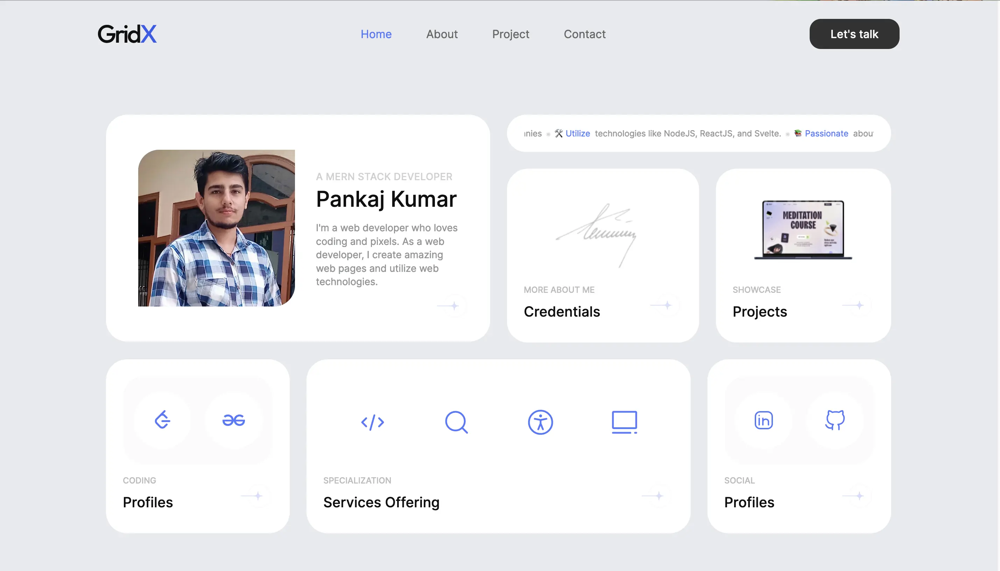

# My Personal Portfolio Website

Welcome to my personal portfolio website! This project showcases my skills, projects, and experiences as a web developer. It's built using React and includes features such as responsive design, email integration, and more.
<br>

Live Preview <a href="https://gridx-portfolio.onrender.com/" target="_blank">Click Me 👇</a>

## Table of Contents

- [Introduction](#introduction)
- [Features](#features)
- [Getting Started](#getting-started)
  - [Prerequisites](#prerequisites)
  - [Installation](#installation)
  - [Configuration](#configuration)
- [Usage](#usage)
- [Contributing](#contributing)
- [License](#license)

## Introduction

This personal portfolio website serves as an online showcase of my work, skills, and achievements in the field of web development. It provides an interactive and user-friendly interface for visitors to learn more about me and my projects.

## Features

- **Responsive Design**: The website is designed to be responsive and adaptable to various screen sizes, ensuring a consistent user experience across devices.
- **Project Showcase**: Showcase your projects, skills, and achievements with detailed descriptions and visuals.
- **Email Integration**: Allow visitors to easily contact you through the website using a contact form.
- **Route Navigation**: Implement smooth navigation between different sections of the website using React Router.
- **Error Handling**: Handle route errors and provide a user-friendly experience using custom error handling.

## Getting Started

### Prerequisites

Before you begin, ensure you have the following software installed:

- [Node.js](https://nodejs.org/) (v14 or higher)
- [npm](https://www.npmjs.com/) (comes with Node.js)

### Installation

1. Clone this repository to your local machine:

   ```bash
   git clone https://github.com/PankajBaliyan/GridX-Portfolio
   ```

2. Navigate to the project directory:

   ```bash
   cd GridX-Portfolio
   ```

3. Install the project dependencies:

   ```bash
   npm install
   ```

### Configuration

1. Rename the `.env.example` file to `.env` and update the following variables with your EmailJS credentials:

   ```
   REACT_APP_SERVICE_ID=your-service-id
   REACT_APP_TEMPLATE_ID=your-template-id
   REACT_APP_USER_ID=your-user-id
   ```

2. Customize the content, projects, and sections of the website in the respective components.

## Usage

To start the development server and view your website, run:

```bash
npm start
```

This will launch the website in your default web browser. As you make changes to the code, the website will automatically update in the browser.

## Contributing

Contributions are welcome! If you'd like to contribute to this project, please follow these steps:

1. Fork the repository.
2. Create a new branch for your feature or bug fix.
3. Make your changes and test them thoroughly.
4. Commit your changes and push them to your fork.
5. Submit a pull request to the main repository.

## License

This project is licensed under the [MIT License](LICENSE).

## Preview
